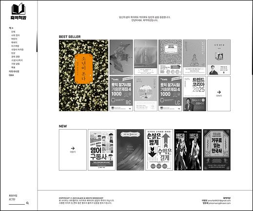
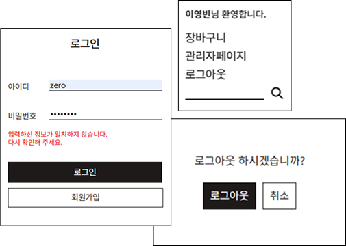
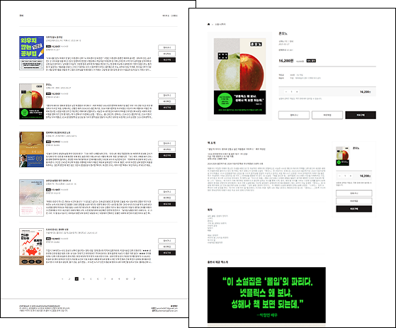
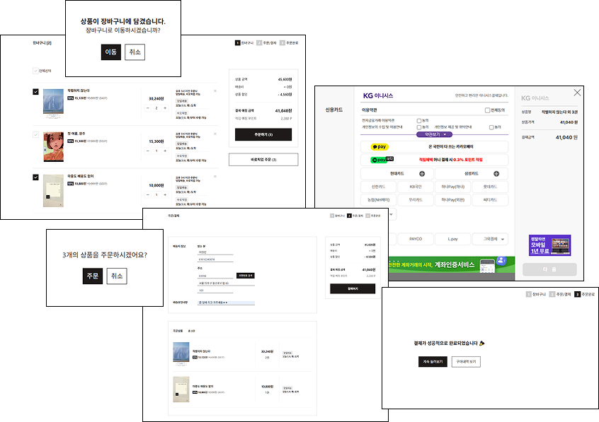
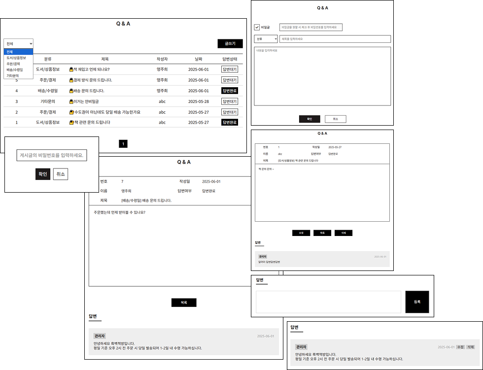
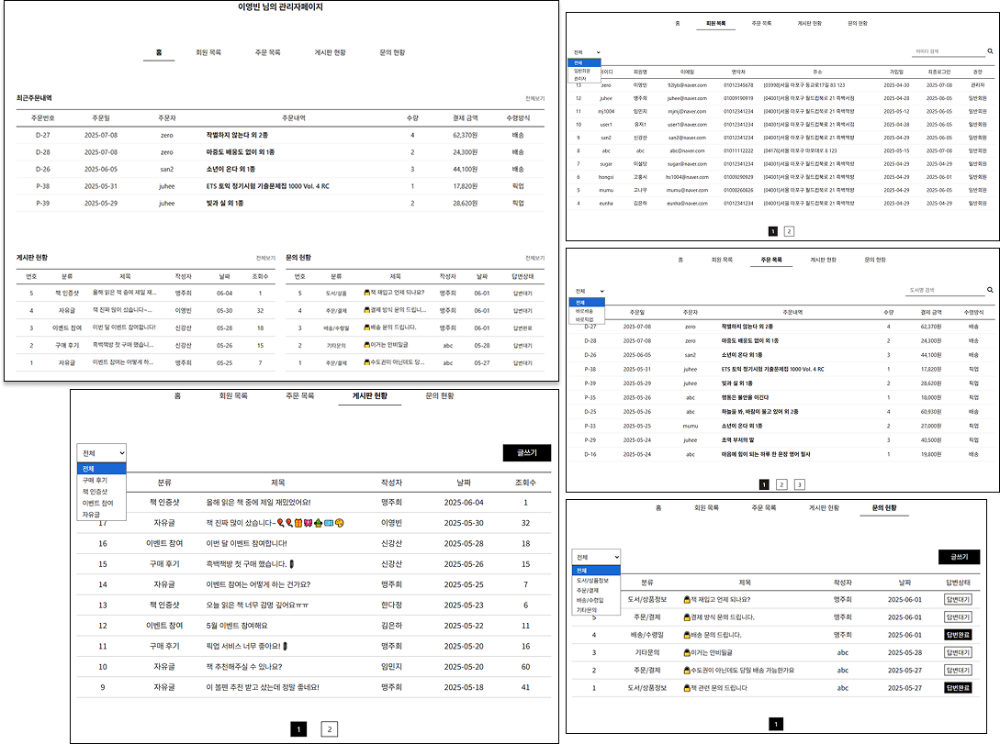

<h1>흑백책방</h1>

도서 구매, 픽업 예약, 게시판 기능이 있는 사이트를 Spring Boot, React로 제작한 웹 서비스입니다.

 
<h2>⛏사용기술</h2>
<h3>Frontend</h3>
<ul>
  <li><b>Language</b> : HTML5, CSS3</li>
  <li><b>Library & Framework</b> : React, axios</li>
</ul>
<h3>Backend</h3>
<ul>
  <li><b>Language</b> : Java11</li>
  <li><b>Library & Frameword</b> : Spring Boot</li>
  <li><b>Database</b> : Oracle21c</li>
  <li><b>ORM</b> : JPA</li>
</ul>
 
<h2>✨담당 구현</h2>
<ul>
  <li>
    
메인페이지

    
    <ul>
      <li>React - 메인 페이지 UI 구현</li>
      <li>JPA - 조건에 맞는 목록 출력</li>
    </ul>
  </li>
  <li>
    
로그인/로그아웃

    
    <ul>
      <li>axios - 로그인/로그아웃 기능 구현</li>
    </ul>
  </li>
  <li>
    
도서 목록/상세 페이지

    
    <ul>
      <li>useQuery - 도서 목록 출력, 정렬, 페이지네이션</li>
    </ul>
  </li>
  <li>
    
상품 장바구니/결제 페이지

    
    <ul>
      <li>useQuery - 장바구니 목록 출력</li>
      <li>useMutation - 장바구니 목록 수정, 삭제</li>
      <li>useMemo - 총 결제액, 총 수량 수정</li>
    </ul>
  </li>
  <li>
    
답변형 QNA 페이지

    
    <ul>
      <li>React, JPA - 관리자/글쓴이/일반회원의 권한에 따른 답변형 게시판 CRUD</li>
    </ul>
  </li>
  <li>
    
관리자 페이지

    
    <ul>
      <li>useEffect, JPA - 전체 회원/주문/게시판/문의 목록 출력</li>
    </ul>
  </li>
</ul>
